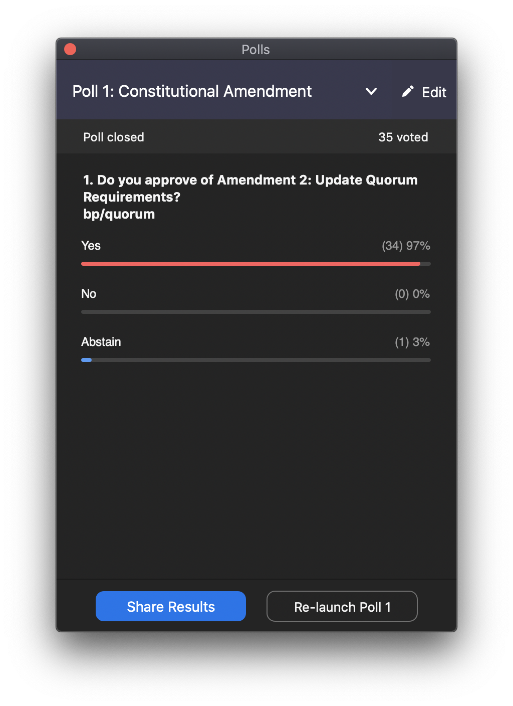

# Amendment 2

Drafted: Frederick Kim

Proposed: 2020.04.26

Proposed by: Executive Team

Ratified: 2020.04.27

## Voting Record

    Votes: 47 Total Membership, 34 Yes, 0 No, 1 Abstain

[Voting Record](assets/Amendment_2_Spring2020_Voting_Record.csv)



## Text

[Decision Log Entry](https://www.notion.so/Proposal-to-Update-Quorum-Requirements-3ab51c9c07294c24b92037743376f0c3)

> A quorum should be defined as 2/3 of membership, whether it's general membership or e-team. If the resulting number is not an perfect integer, quorum should rounded to the nearest integer.

> With regard to elections, it is unreasonable for there to be a full quorum of eligible voters to hold an election. In the past, we have held quorum at 2/3 of general membership even if it was inconsistent with the constitution. Therefore, this amendment seeks to update the constitution to be in line with what is actually being practiced.

> With regards to e-team quorum, the [recent bylaw addition for co-presidents](https://github.com/calblueprint/constitution/pull/13) introduces the potential for fluctuating e-team membership numbers. In order to prevent the need to constantly change the constitution, a 2/3 quorum of e-team membership makes more sense. 

> The changes to Section V and IV.2 is also an update that was not caught in [Amendment 2: Add Vice President of Design](https://github.com/calblueprint/constitution/pull/6).

## Changes

### IV. OFFICERS & ELECTIONS

#### 1. Executive Committee

```diff
- 2. Consent of the Executive Committee is when two-thirds of its members agree. The quorum for decision making is five.
+ 2. Consent of the Executive Committee is when two-thirds of its members agree. The quorum for decision making is two-thirds of Executive Committee members.
```

#### 2. President

```diff
- ... The order of succession is the order in which the offices are stated in the constitution: Internal Vice President, External Vice President, Vice President of Projects, Vice President of Technology.
+ ... The order of succession is the order in which the offices are stated in the constitution: Internal Vice President, External Vice President, Vice President of Projects, Vice President of Technology, Vice President of Design.
```

#### 8. Elections

```diff
- 3. During elections, eligible general members will vote. Eligibility will be determined by the Executive Committee. Elections shall occur during general meeting only with a full quorum of the eligible voting membership.
+ 3. During elections, eligible general members will vote. Eligibility will be determined by the Executive Committee. Elections shall occur during general meeting only with a quorum of two-thirds the eligible voting membership.
```

### V. MEETINGS

#### 2. Executive Committee Meetings

```diff
- 1. The Executive Committee shall assemble at least once every week. A quorum for meetings is three Executive Committee members.
+ 1. The Executive Committee shall assemble at least once every week. A quorum for meetings is two-thirds of Executive Committee members.
```

#### 3. Special Emergency Meetings

```diff
- 2. Special emergency meetings shall, with three-fifths approval of the Executive Committee, be called on by the President of Blueprint for general membership meetings.
+ 2. Special emergency meetings shall, with two-thirds approval of the Executive Committee, be called on by the President of Blueprint for general membership meetings.
```
